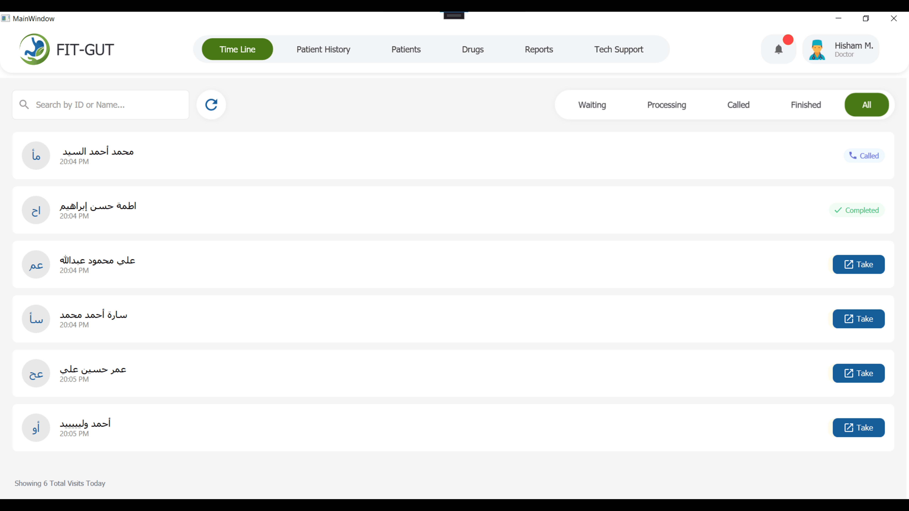
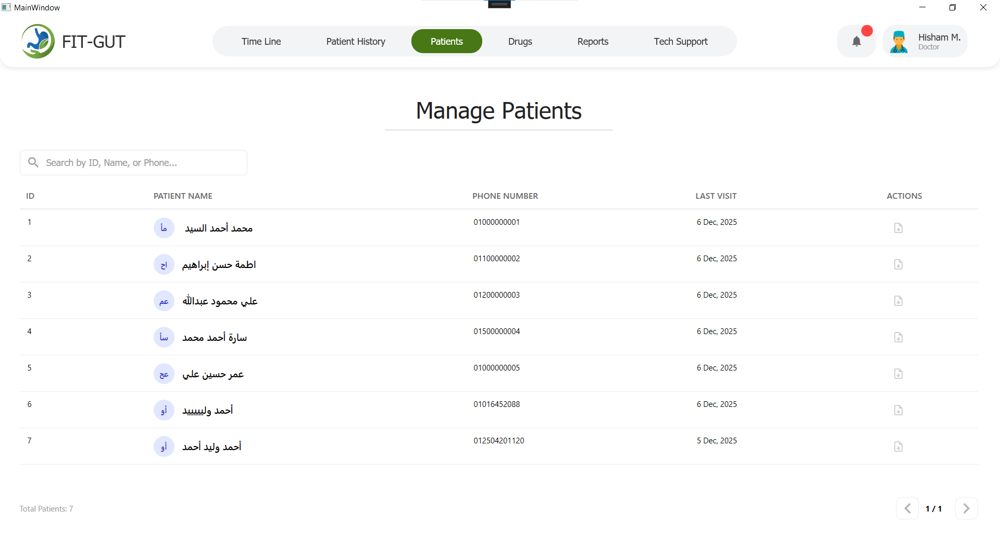
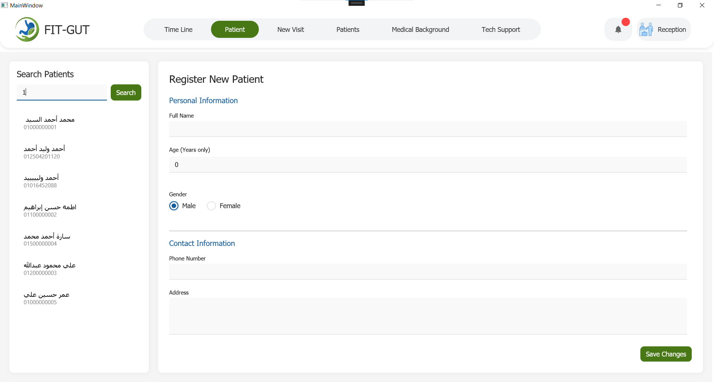
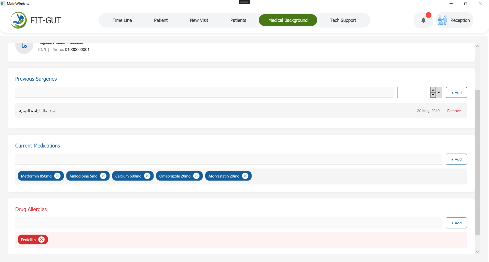
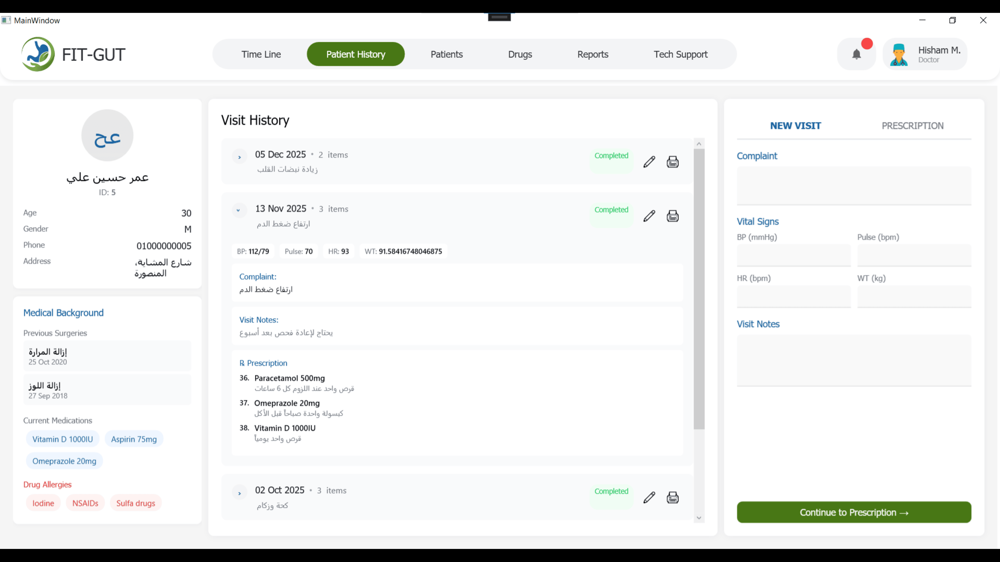
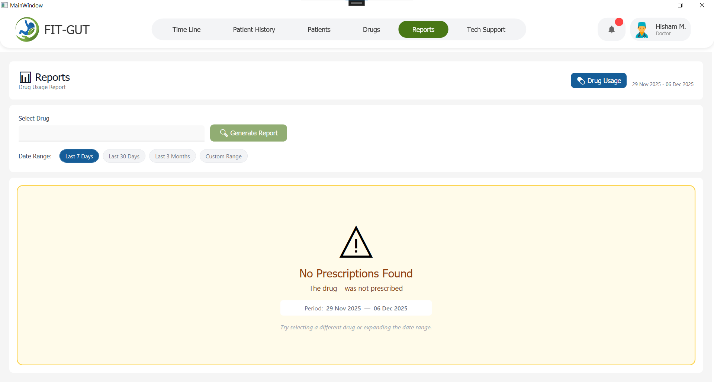
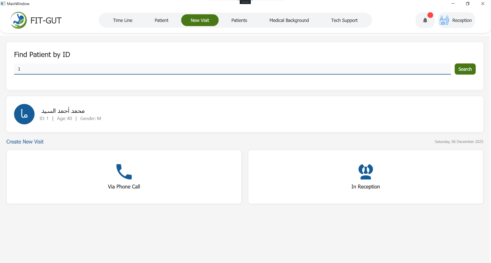
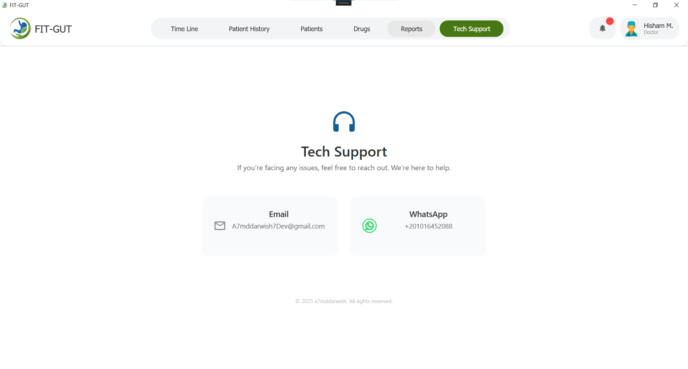

# FitGut Clinic — Product Screens and User Guide

This document showcases the clinic system screens with clear, doctor- and reception-focused descriptions. All screenshots are stored in the Assets/ folder and referenced below.

Notes:
- Make sure every screenshot file name exactly matches the names used here (case-sensitive), with .png extension.
- If you rename a screenshot, update the path in this README.

---

## Table of Contents
- [Who this system serves](#who-this-system-serves)
- [Core promises](#core-promises)
- [Timeline](#timeline)
- [Patients](#patients)
- [Add Patient](#add-patient)
- [Medical Background](#medical-background)
- [Patient History](#patient-history)
- [Reports — Drug Usage](#reports--drug-usage)
- [New Visit](#new-visit)
- [Tech Support](#tech-support)
- [How reception and doctor stay in sync](#how-reception-and-doctor-stay-in-sync)
- [Screenshots folder structure](#screenshots-folder-structure)

---

## Who this system serves
- Doctors who need a clean, fast way to see today’s patients, review history, and make safe decisions.
- Reception staff who register patients, manage today’s flow, and keep doctors updated—without confusion or delay.

## Core promises
- Clarity: Each screen speaks the language of the clinic, not the computer.
- Speed: Smooth searching, quick actions, and focused workflows.
- Safety: Gentle warnings, clear states, and helpful loading messages when things take a moment.
- Harmony: Reception and doctor views stay in sync so the day runs on time.

---

## Timeline
Your “control room” for today’s visits: who’s waiting, who’s being seen, who was called, and who’s finished.

What you can do
- Instantly filter by status: Waiting, Processing, Called, or Completed—see only what matters now.
- Search by patient name or ID for quick retrieval.
- Start seeing a patient with “Take” (for doctors) directly from the list.
- Right-click menu (where allowed) to cancel a visit, change status, or move patients back to waiting if needed.

Why this helps
- Keeps everyone on the same page with live updates.
- Reduces corridor noise and confusion by showing exactly where each patient is in the journey.
- Saves time—no need to jump between screens to understand the day’s flow.

Smart touches
- Clean badges and clear colors for every state.
- Gentle messages and confirmations to avoid mistakes.
- Loading overlay appears briefly when updating the list so you always know what’s happening.

---

## Patients
A clean list of all patients with fast search and easy scanning—even with a large database.

What you can do
- Search by ID, name, or phone number (quick, forgiving search).
- See key details at a glance: full name, phone, and last visit date.
- Use action buttons per patient:
  - View History (for doctors)
  - Edit Patient (for reception)
  - New Visit (for reception)

Why this helps
- You don’t hunt; you find. The screen is built for daily use with calm visuals and quick actions.
- Handles large patient lists without lag, keeping your clinic fast and focused.

Smart touches
- Clear, eye-friendly layout with a quiet color palette.
- Subtle hover actions so the screen stays calm until you need it.
- Paging and efficient loading behind the scenes so the list stays responsive.

---

## Add Patient
Register a new patient or update an existing one through a clear, safe form.

What you can do
- Add or edit: full name, age, gender, phone, and address.
- Prevent duplicate phone numbers with a friendly error message.
- After saving, see success confirmation with the new Patient ID.
- Quick next step: start a New Visit right away, or register another patient.

Why this helps
- Removes second-guessing with gentle validations (age must be positive, phone must be digits, etc.).
- Smooth process for both new registrations and editing existing records.

Smart touches
- Loading overlay appears during saving so you always know the system is working.
- Clear success state designed to guide the next step (visit, edit more, or return).

---

## Medical Background
One place to record the essentials: surgeries, current medications, and drug allergies.

What you can do
- Find a patient by ID, then load their existing background if it exists.
- Add past surgeries (name + date) with a simple, focused input.
- Add current medications by typing freely (no rigid dropdowns).
- Add drug allergies the same way—type what you need and add.
- Save everything together in one action.

Why this helps
- Captures the reality of clinical work—sometimes you need to write it your way.
- Gives doctors the critical risk picture (surgeries and allergies) without noise.

Smart touches
- Chips (pills) for medications and allergies—easy to scan and remove when needed.
- No accidental database noise: typing a medication or allergy does not create a permanent entry by itself; it’s saved only as part of the patient’s medical background.
- Helpful loading overlays during search and save operations to keep you informed.

---

## Patient History
A clear, focused view of a patient’s journey in your clinic.

What you can do
- Review past visits quickly.
- See treatments, prescriptions, and key notes in an organized, readable layout.
- Arrive prepared—know the context before you decide.

Why this helps
- Reduces rework and duplicated questions.
- Improves clinical decisions with a full, readable picture at a glance.

Smart touches
- Calm typography and structure for stress-free reading.
- Designed to be a “pre-visit briefing” for the doctor.

---

## Reports — Drug Usage
A practical report to see how a medication was used over time.

What you can do
- Select a medication and a time window (Last 7 Days, 30 Days, 3 Months, or a custom range).
- See total prescriptions and unique patients for that period.
- Review a detailed list of patients and each date the drug was prescribed.

Why this helps
- Supports safe prescribing with a quick understanding of usage patterns.
- Helps clinics audit and plan based on real data, not guesses.

Smart touches
- Friendly message if the drug wasn’t prescribed in the chosen period.
- Clear summary cards and clean table of results for fast reading.

---

## New Visit
Start a new visit in seconds—no fuss, no confusion.

What you can do
- Begin a visit right after registering a patient or from the Patients list.
- Get the patient ready for the doctor with minimal steps.

Why this helps
- Keeps the clinic moving—reception prepares, doctor proceeds.
- Integrates smoothly with the Timeline so everyone stays aligned.

Smart touches
- Subtle cues guide reception to the next step.
- Designed to “just work” in busy hours.

---

## Tech Support
A simple internal place to ask for help or report an issue quickly.

What you can do
- Send a quick note about a problem or request guidance.
- Keep the team moving without long interruptions.

Why this helps
- Reduces downtime by making help just one click away.

---

## How reception and doctor stay in sync
- Shared reality: Reception and doctor see the same day, the same statuses.
- New cases: As soon as reception registers a new visit, doctors see it on the Timeline.
- Smooth handoff: The “Take” action confirms the doctor is handling it, keeping the flow organized.
- Transparency: When a process takes a moment (loading or saving), a neat loading message appears—no one wonders what’s happening.

